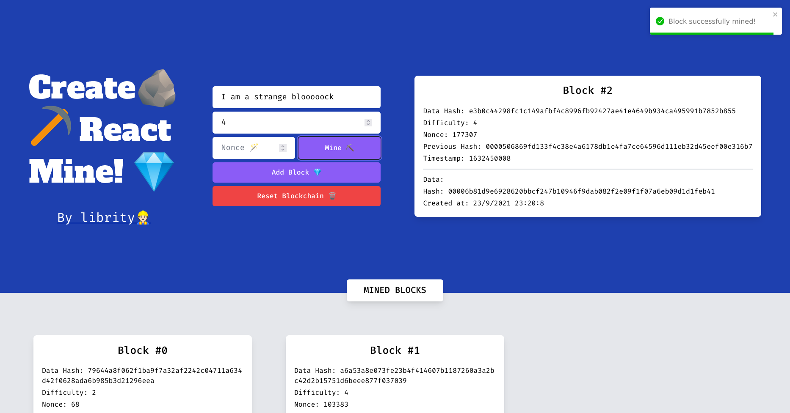

# [Create React Mine](https://create-react-mine.vercel.app/)

<p align="center">
  
</p>

## Table of Contents

- [About](#about)
- [Getting Started](#getting_started)
- [Usage](#usage)
- [Packages](#packages)
- [Docs](#docs)
- [Resources](#resources)

## About <a name = "about"></a>

A Proof of Work mining simulator made with Typescript and Next.js.
Based on [Nomad Coder's implementation](https://mining-simulator.netlify.app/).
It uses the same Block Header structure
[as Bitcoin](https://en.bitcoin.it/wiki/Block_hashing_algorithm).

- [Production App](https://create-react-mine.vercel.app/)
- [Figma](https://www.figma.com/file/d4ZQuLT7CVqr161wB1yAzX/Create-React-Mine?node-id=0%3A1)

## Getting Started <a name = "getting_started"></a>

### Prerequisites

- `node >= 14.0.0`

### Installation

1. Clone this repo locally and install the required packages:

```bash
$ git clone https://github.com/librity/create_react_mine.git
$ cd create_react_mine
$ npm install
```

2. Start a dev server:

```bash
$ npm run dev
```

3. Open http://localhost:3000 on your web browser.

#### Format

Format all source files with Prettier:

```bash
$ npm run format
```

## Usage <a name = "usage"></a>

You can change the block's `data`, `difficulty` and `nonce`.
You can also mine it automatically.
It takes a while for any difficulty higher than 4.

## Packages <a name = "packages"></a>

- https://github.com/nvm-sh/nvm
- https://github.com/brix/crypto-js
- https://prettier.io/docs/en/configuration.html
- https://github.com/tailwindlabs/tailwindcss
- https://github.com/react-hook-form/react-hook-form
- https://github.com/fkhadra/react-toastify

## Docs <a name = "docs"></a>

- [React.js](https://reactjs.org/docs/getting-started.html)
- [Next.js](https://nextjs.org/docs) - learn about Next.js features and API.
- [Create React App](https://create-react-app.dev/docs/getting-started)
- [Learn Next.js](https://nextjs.org/learn) - an interactive Next.js tutorial.
- [Vercel deployment](https://nextjs.org/docs/deployment)
- [Tailwind CSS Framework](https://tailwindcss.com/docs/guides/nextjs)

## Resources <a name = "resources"></a>

### NPM

- https://josipmisko.com/posts/how-to-update-npm-packages-in-4-easy-steps
- https://muffinman.io/blog/nvm-updating-npm/

### Javascript

- https://www.w3docs.com/snippets/javascript/how-to-convert-object-to-string.html
- https://stackoverflow.com/questions/8353272/private-vs-protected-visibility-good-practice-concern
- https://stackoverflow.com/questions/32647215/declaring-static-constants-in-es6-classes
- https://stackoverflow.com/questions/34112577/javascript-for-loop-how-to-make-it-repeat-forever
- https://www.delftstack.com/howto/javascript/javascript-convert-timestamp-to-date/

### Typescript

- https://wesleygrimes.com/angular/2019/02/14/how-to-use-tslint-to-autoremove-all-unused-imports-in-a-typescript-project.html
- https://nextjs.org/docs/advanced-features/module-path-aliases
- https://www.carlrippon.com/when-to-use-type-aliases-v-interfaces/

### React

- https://reactjs.org/docs/lists-and-keys.html#keys
- https://stackoverflow.com/questions/40032592/typescript-workaround-for-rest-props-in-react
- https://stackoverflow.com/questions/40676343/typescript-input-onchange-event-target-value
- https://stackoverflow.com/questions/53688899/typescript-and-react-children-type
- https://stackoverflow.com/questions/57424821/typescript-extend-react-component-props-for-styled-component-element
- https://stackoverflow.com/questions/8896327/jquery-wait-delay-1-second-without-executing-code
- https://stackoverflow.com/questions/58812323/how-to-run-a-while-loop-in-a-react-component-while-this-state-x
- https://stackoverflow.com/questions/65473043/how-to-break-a-loop-onclick-reactjs
- https://stackoverflow.com/questions/53070970/infinite-loop-in-useeffect
- https://dmitripavlutin.com/dont-overuse-react-usecallback/
- https://openbase.com/categories/js/best-react-forms-libraries
- https://reactjs.org/docs/forms.html

### HTML

- https://www.w3schools.com/Tags/att_button_disabled.asp

### CSS

- https://flexbox.malven.co/
- https://webdesign.tutsplus.com/tutorials/a-comprehensive-guide-to-flexbox-sizing--cms-31948
- https://stackoverflow.com/questions/37300614/how-to-adapt-a-flex-divs-width-to-content
- https://developer.mozilla.org/en-US/docs/Web/CSS/CSS_Flexible_Box_Layout/Controlling_Ratios_of_Flex_Items_Along_the_Main_Ax

### CSS Frameworks

- https://github.com/tailwindlabs/tailwindcss
- https://github.com/mui-org/material-ui-x
- https://github.com/system-ui/theme-ui
- https://github.com/twbs/bootstrap

### Bitcoin

- https://en.bitcoin.it/wiki/Block_hashing_algorithm
